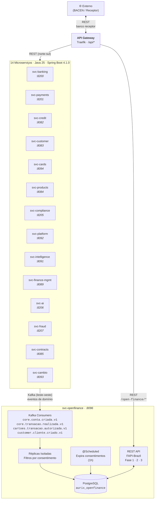

# Aurix Core Banking

[](https://github.com/aurix-core-banking/aurix-backend)
[](https://github.com/aurix-core-banking/aurix-frontend)
[](https://github.com/aurix-core-banking/aurix-openfinance)
[](https://github.com/aurix-core-banking/aurix-infrastructure)
[](https://github.com/aurix-core-banking/aurix-tests)
[](https://github.com/aurix-core-banking/aurix-ml)

---

Plataforma completa de core banking para o mercado brasileiro. Modular, event-driven, e construída para escala. Toda a base de código e documentação é em **português**.

## Ecossistema

A Aurix é dividida em repositórios independentes, cada um responsável por uma camada da plataforma:

### Core

| Repositório | Descrição | Stack |
|---|---|---|
| **[aurix-backend](https://github.com/aurix-core-banking/aurix-backend)** | 14 microserviços Spring Boot (contas, transações, PIX, crédito, câmbio, cartões, compliance, fraude, IA, etc.). API REST, eventos via Kafka, banco único compartilhado (PostgreSQL). | Java 25, Spring Boot 4.1.0, Spring Cloud 2025.1.2, Maven |
| **[aurix-openfinance](https://github.com/aurix-core-banking/aurix-openfinance)** | Microserviço dedicado ao Open Finance Brasil (BACEN). Consome eventos do core banking via Kafka, mantém réplicas de leitura isoladas para exposição segura a bancos receptores. APIs de consentimento, contas, transações e cartões (Fase 1 + Fase 2). | Java 25, Spring Boot 4.1.0, PostgreSQL, Flyway, Kafka, Springdoc |
| **[aurix-frontend](https://github.com/aurix-core-banking/aurix-frontend)** | Interface web (React + MUI), painel administrativo (React Admin) e app mobile (React Native). | React 18, MUI v5, React Native 0.73, CRA |

### Dados e IA

| Repositório | Descrição | Stack |
|---|---|---|
| **[aurix-data-pipelines](https://github.com/aurix-core-banking/aurix-data-pipelines)** | Pipelines ETL/streaming: ingestão PostgreSQL → Bronze, processamento Spark/Flink, transformação dbt (Bronze → Silver → Gold), orquestração Airflow. | PySpark, Apache Flink, dbt, Airflow, Kafka |
| **[aurix-data-platform](https://github.com/aurix-core-banking/aurix-data-platform)** | Data lake e analytics: ClickHouse para OLAP, TimescaleDB para séries temporais, Elasticsearch para buscas. Replicação real-time do core banking. | ClickHouse, TimescaleDB, Elasticsearch |
| **[aurix-ml](https://github.com/aurix-core-banking/aurix-ml)** | Modelos de ML: scoring de crédito (XGBoost), detecção de fraude, previsão de default, segmentação de clientes. Serving via FastAPI, governança por regime (R1-R3). | Python, scikit-learn, XGBoost, MLflow, FastAPI |

### Operações

| Repositório | Descrição | Stack |
|---|---|---|
| **[aurix-infrastructure](https://github.com/aurix-core-banking/aurix-infrastructure)** | Infraestrutura como código: Docker Compose (dev local), Terraform (multi-cloud AWS/Azure/GCP), Kubernetes (Helm charts + ArgoCD), monitoramento (Prometheus + Grafana). | Terraform, Kubernetes, Docker, Helm, Istio |
| **[aurix-tests](https://github.com/aurix-core-banking/aurix-tests)** | Testes E2E (Playwright), integração (REST Assured) e performance (k6). Cobertura cross-service que valida a plataforma inteira. | Python, Playwright, REST Assured, k6 |

### Conhecimento

| Repositório | Descrição |
|---|---|
| **[aurix-docs](https://github.com/aurix-core-banking/aurix-docs)** | Documentação técnica: visão geral da arquitetura, ADRs (Architecture Decision Records), guias de desenvolvimento, runbooks operacionais, checklists de completude, specs de design e planos de implementação. |

## Arquitetura



### Fluxo de dados

1. **Ingestão**: `svc-banking`, `svc-cards`, `svc-customer` publicam eventos Kafka no formato `<domínio>.<entidade>.<evento>.<versao>`
2. **Consumo**: `svc-openfinance` consome os eventos e filtra por consentimentos ativos
3. **Replicação**: Dados são escritos em tabelas isoladas (`aurix_openfinance`), nunca acessa o core banking diretamente
4. **Consulta**: Banco receptor consulta via REST FAPI-Brazil com token de consentimento
5. **Limpeza**: Job `@Scheduled` expira consentimentos e apaga réplicas (a cada 1h)

### Open Finance Brasil

| Fase | Escopo | Status |
|---|---|---|
| **Fase 1** | Contas, transações, saldos, consentimento, dados pessoais | ✅ Implementado |
| **Fase 2** | Cartões de crédito, faturas, transações de cartão | ✅ Implementado |
| **Fase 3** | Empréstimos, seguros, Pix | ✅ Implementado |

## Stack

| Camada | Tecnologias |
|---|---|
| Backend | Java 25, Spring Boot 4.1.0, Spring Cloud 2025.1.2, Maven multi-module |
| Frontend | React 18, MUI v5, React Native 0.73, react-router-dom v6 |
| Open Finance | Spring Boot 4.1.0, Spring Security (FAPI-Brazil), Flyway, Springdoc OpenAPI |
| Data | PySpark, Apache Flink, dbt, Airflow, Kafka Streams |
| ML | Python, scikit-learn, XGBoost, MLflow, FastAPI |
| Infra | Terraform (AWS/Azure/GCP), Kubernetes, Helm, Docker Compose, Istio |
| Observabilidade | Prometheus, Grafana, Elasticsearch, Kibana |
| Banco de dados | PostgreSQL 15, ClickHouse, TimescaleDB, Redis 7 |
| Mensageria | Apache Kafka + Zookeeper (61+ tópicos domain-driven) |
| Segurança | Keycloak 23 (OIDC/FAPI), mTLS, API keys, OAuth2 |
| Testes | Playwright (E2E), REST Assured (integração), k6 (performance) |

## Repositórios

| Repo | Porta(s) | Descrição curta |
|---|---|---|
| `aurix-backend` | 8080-8207 | 14 microserviços Spring Boot |
| `aurix-openfinance` | 8096 | APIs Open Finance Brasil (BACEN) |
| `aurix-frontend` | 3000/3001 | Web, admin, mobile |
| `aurix-data-pipelines` | — | ETL e streaming |
| `aurix-data-platform` | 8123/9002 | ClickHouse, Elasticsearch |
| `aurix-ml` | 8300 | Modelos de ML + serving |
| `aurix-infrastructure` | — | Terraform, K8s, Docker |
| `aurix-tests` | — | E2E, integração, performance |
| `aurix-docs` | — | Documentação técnica |

## Início rápido

```bash
# Clone o monorepo
git clone git@github.com:aurix-core-banking/aurix-core-banking.git
cd aurix-core-banking

# Clone todos os componentes
make clone-all

# Sobe infraestrutura local (PostgreSQL, Kafka, Redis, Keycloak, etc.)
cd aurix-infrastructure && docker-compose up -d

# Compila o backend
cd aurix-backend && ./mvnw clean install -DskipTests

# Roda um serviço específico
./mvnw spring-boot:run -pl svc-banking

# Roda o Open Finance
cd ../aurix-openfinance && ./mvnw spring-boot:run -pl svc-openfinance
```

## Open Finance

O `aurix-openfinance` implementa as APIs do **Open Finance Brasil** (BACEN) seguindo o padrão FAPI-Brazil:

| Fase | Escopo | Status |
|---|---|---|
| **Fase 1** | Contas, transações, saldos, consentimento, dados pessoais (identificação, endereços, contatos) | ✅ Implementado |
| **Fase 2** | Cartões de crédito | 🚧 Placeholder |
| **Fase 3** | Pix, empréstimos, seguros | 📋 Planejado |

### Fase 1 — Endpoints

| Domínio | Endpoints | Kafka Consumers |
|---|---|---|
| Consentimento | `POST /consents`, `GET /consents/{id}`, `POST .../authorise`, `POST .../reject`, `POST .../revoke` | — |
| Contas | `GET /accounts`, `GET /accounts/{id}`, `GET /accounts/{id}/balances` | `core.conta.criada.v1`, `core.conta.atualizada.v1` |
| Transações | `GET /accounts/{id}/transactions` | `core.transacao.realizada.v1`, `core.transacao.liquidada.v1` |
| Dados pessoais | `GET /customers/personal/identifications`, `.../addresses`, `.../phone-numbers`, `.../email`, `GET /customers/business/identifications`, `.../addresses` | `customer.cliente.criado.v1`, `customer.cliente.atualizado.v1` |
| Cartões | `GET /credit-cards` (Fase 2) | `cartoes.transacao.autorizada.v1` |

### Fluxo de dados

```
svc-banking / svc-cards / svc-customer
         │ Kafka events
         ▼
  svc-openfinance (consumidor)
         │ filtra por consentimentos ativos
         │ escreve em réplicas isoladas
         ▼
  PostgreSQL (aurix_openfinance)
         │
         ▼ REST (banco receptor consulta)
  Externo (BACEN / receptor)
```

### Infraestrutura

| Componente | Configuração |
|---|---|
| Porta | `8096` |
| Docker Compose | `svc-openfinance` com health check |
| Traefik | Rota `/open-finance/*` → `svc-openfinance:8096` |
| Prometheus | Scrape config em `monitoring/prometheus.yml` |
| Helm | `kubernetes/charts/svc-openfinance` (deployment, service, hpa, pdb) |
| OpenAPI | `/swagger-ui.html` · Spec: `openapi/aurix-openfinance.yaml` |
| Flyway | V1 (consentimento, contas, transações) + V2 (pessoas) |
| Limpeza | `@Scheduled` expira consentimentos + apaga réplicas (1h) |

## Documentação

Toda a documentação consolidada está em [`aurix-docs`](https://github.com/aurix-core-banking/aurix-docs), incluindo:

- Visão geral da arquitetura
- Architecture Decision Records (ADRs)
- Guias de desenvolvimento
- Runbooks operacionais
- Specs de design e planos de implementação
- Checklists de completude

---

**Organização**: [aurix-core-banking](https://github.com/aurix-core-banking) · **Versão**: 2.0.0
