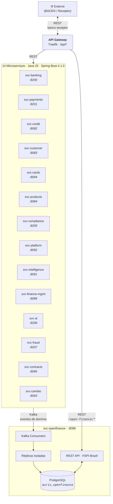

# Aurix Core Banking

[](https://github.com/aurix-core-banking/aurix-backend)
[](https://github.com/aurix-core-banking/aurix-frontend)
[](https://github.com/aurix-core-banking/aurix-openfinance)
[](https://github.com/aurix-core-banking/aurix-infrastructure)
[](https://github.com/aurix-core-banking/aurix-tests)
[](https://github.com/aurix-core-banking/aurix-ml)

---

Plataforma de core banking para o mercado brasileiro. Modular, event-driven, e construída para escala. Toda a base de código e documentação é em **português**.

## Arquitetura



## Open Finance Brasil

`svc-openfinance` expõe as APIs do **Open Finance Brasil** (BACEN) no padrão FAPI-Bridge. Dados do core banking são replicados via Kafka para tabelas isoladas — o core nunca é acessado diretamente por bancos receptores.

### APIs disponíveis

| Domínio | Endpoints |
|---|---|
| **Consentimentos** | `POST /consents`, `GET /consents/{id}`, `POST .../authorise`, `POST .../reject`, `POST .../revoke` |
| **Contas** | `GET /accounts`, `GET /accounts/{id}`, `GET /accounts/{id}/balances` |
| **Transações** | `GET /accounts/{id}/transactions` |
| **Dados pessoais** | `GET /customers/personal/identifications`, `.../addresses`, `.../phone-numbers`, `.../email`, `GET /customers/business/identifications`, `.../addresses` |
| **Cartões de crédito** | `GET /credit-cards`, `GET /credit-cards/{id}`, `GET /credit-cards/{id}/bills`, `GET /credit-cards/{id}/bills/{billId}`, `GET /credit-cards/{id}/transactions` |
| **Empréstimos** | `GET /loans`, `GET /loans/{id}` |
| **Seguros** | `GET /insurance`, `GET /insurance/{id}` |
| **PIX** | `GET /pix/credit-transfers`, `GET /pix/credit-transfers/{id}` |

### Como funciona

1. **Ingestão**: Microserviços publicam eventos Kafka (`core.conta.criada.v1`, `cartoes.transacao.autorizada.v1`, etc.)
2. **Consumo**: `svc-openfinance` consome os eventos e filtra por consentimentos ativos
3. **Replicação**: Dados são escritos em tabelas isoladas (`aurix_openfinance`), com limpeza automática de consentimentos expirados
4. **Consulta**: Banco receptor consulta via REST com token de consentimento

## Ecossistema

| Repositório | Descrição | Stack |
|---|---|---|
| **[aurix-backend](https://github.com/aurix-core-banking/aurix-backend)** | 14 microserviços: contas, transações, PIX, crédito, câmbio, cartões, compliance, fraude, IA. API REST, eventos Kafka, PostgreSQL compartilhado. | Java 25, Spring Boot 4.1.0, Maven |
| **[aurix-openfinance](https://github.com/aurix-core-banking/aurix-openfinance)** | APIs Open Finance Brasil (BACEN) — FAPI-Bridge. Consome eventos Kafka, mantém réplicas isoladas para exposição segura. | Java 25, Spring Boot 4.1.0, Flyway, Kafka |
| **[aurix-frontend](https://github.com/aurix-core-banking/aurix-frontend)** | Internet banking (React), admin (React Admin), mobile (React Native). | React 18, MUI v5, React Native 0.73 |
| **[aurix-data-pipelines](https://github.com/aurix-core-banking/aurix-data-pipelines)** | ETL/streaming: PostgreSQL → Bronze → Silver → Gold. Orquestração Airflow. | PySpark, Flink, dbt, Airflow |
| **[aurix-data-platform](https://github.com/aurix-core-banking/aurix-data-platform)** | Data lake: ClickHouse (OLAP), TimescaleDB (séries temporais), Elasticsearch (buscas). | ClickHouse, TimescaleDB, Elasticsearch |
| **[aurix-ml](https://github.com/aurix-core-banking/aurix-ml)** | Scoring de crédito, detecção de fraude, previsão de default, segmentação. Serving FastAPI, governança por regime. | Python, XGBoost, MLflow, FastAPI |
| **[aurix-infrastructure](https://github.com/aurix-core-banking/aurix-infrastructure)** | Docker Compose (dev), Terraform (multi-cloud), Kubernetes (Helm + ArgoCD), monitoramento. | Terraform, K8s, Helm, Istio |
| **[aurix-tests](https://github.com/aurix-core-banking/aurix-tests)** | E2E (Playwright), integração (REST Assured), performance (k6). | Python, Playwright, k6 |
| **[aurix-docs](https://github.com/aurix-core-banking/aurix-docs)** | ADRs, guias, runbooks, specs de design, planos de implementação. | — |

## Stack

| Camada | Tecnologias |
|---|---|
| Backend | Java 25, Spring Boot 4.1.0, Spring Cloud 2025.1.2, Maven multi-module |
| Frontend | React 18, MUI v5, React Native 0.73, react-router-dom v6 |
| Open Finance | FAPI-Bridge, Flyway, Springdoc OpenAPI |
| Data | PySpark, Apache Flink, dbt, Airflow, Kafka Streams |
| ML | scikit-learn, XGBoost, MLflow, FastAPI |
| Infra | Terraform (AWS/Azure/GCP), Kubernetes, Helm, Docker Compose, Istio |
| Observabilidade | Prometheus, Grafana, Elasticsearch, Kibana |
| Banco de dados | PostgreSQL 15, ClickHouse, TimescaleDB, Redis 7 |
| Mensageria | Apache Kafka + Zookeeper (61+ tópicos domain-driven) |
| Segurança | Keycloak 23 (OIDC/FAPI), mTLS, API keys, OAuth2 |
| Testes | Playwright (E2E), REST Assured (integração), k6 (performance) |

## Início rápido

```bash
git clone git@github.com:aurix-core-banking/aurix-core-banking.git
cd aurix-core-banking
make clone-all

cd aurix-infrastructure && docker-compose up -d
cd ../aurix-backend && ./mvnw clean install -DskipTests
./mvnw spring-boot:run -pl svc-banking
```

---

**Organização**: [aurix-core-banking](https://github.com/aurix-core-banking) · **Versão**: 2.0.0
